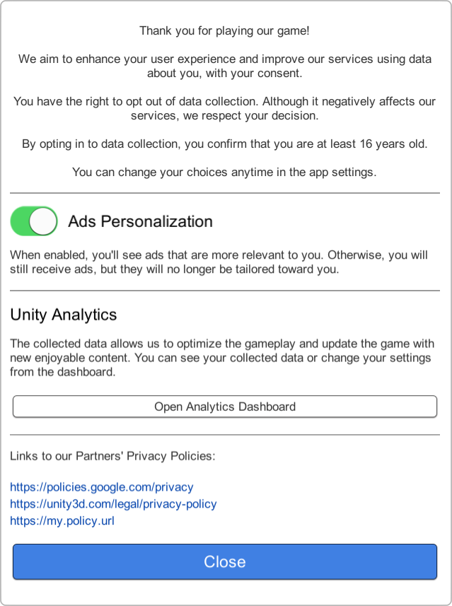

# Unity GDPR Consent Plugin

**Available on Asset Store:** https://assetstore.unity.com/packages/tools/gui/simple-gdpr-consent-151966

**Forum Thread:** https://forum.unity.com/threads/simple-gdpr-consent-open-source.723866/

**[Support the Developer ☕](https://yasirkula.itch.io/unity3d)**

This plugin helps you present a GDPR consent dialog to the users. Please note that you are responsible from forwarding the consent data to your SDKs.

## INSTALLATION

There are 4 ways to install this plugin:

- import [SimpleGDPR.unitypackage](https://github.com/yasirkula/UnitySimpleGDPRConsent/releases) via *Assets-Import Package*
- clone/[download](https://github.com/yasirkula/UnitySimpleGDPRConsent/archive/master.zip) this repository and move the *Plugins* folder to your Unity project's *Assets* folder
- import it from [Asset Store](https://assetstore.unity.com/packages/tools/gui/simple-gdpr-consent-151966)
- *(via Package Manager)* add the following line to *Packages/manifest.json*:
  - `"com.yasirkula.simplegdprconsent": "https://github.com/yasirkula/UnitySimpleGDPRConsent.git",`

## HOW TO

**SimpleGDPR** class has the following functions and properties:

`ConsentState GetConsentState( string identifier )`: returns *Yes*, if user has given consent for the **identifier** event to collect their data (e.g. ads personalization, analytics data collection); *No*, if user has disallowed this data collection and *Unknown*, if the permission hasn't been asked yet

`void ShowDialog( IGDPRDialog dialog, DialogClosedDelegate onDialogClosed = null )`: presents the **dialog** to the user. When the dialog is closed, **onDialogClosed** is invoked (*DialogClosedDelegate* takes no parameters). See the [Dialogs](#dialogs) section below for more info about the dialogs

`IEnumerator WaitForDialog( IGDPRDialog dialog )`: coroutine equivalent of *ShowDialog*

`void OpenURL( string url )`: opens the specified **url** in the web browser. On WebGL, the url is opened in a new tab

`bool IsDialogVisible`: returns *true* if a dialog is currently visible

`bool IsTermsOfServiceAccepted`: returns *true* if user has accepted the *Terms of Service* and/or the *Privacy Policy*

`bool IsGDPRApplicable`: returns *true*, if user is located in the EEA or the request location is unknown. Returns *false*, if user is not located in the EEA. This value is determined by sending a request to `http://adservice.google.com/getconfig/pubvendors`, so an active internet connection is required (on Android, set *Internet Access* to *Require* in Player Settings)

**NOTE:** To comply with GDPR, users must be allowed to change the consents they've provided at any time. So, make sure that users can access the consent dialog from e.g. the settings menu.

## DIALOGS

There are two types of dialogs (*IGDPRDialog*). After creating a dialog instance, you can customize it by chaining the dialog's functions (see [Example Code](example-code)). Then, you can show it to the user via the *ShowDialog* or *WaitForDialog* functions.

### TermsOfServiceDialog


This dialog prompts the user to accept your *Terms of Service* and/or *Privacy Policy*. User must press the **Accept** button to close the dialog.

- `new TermsOfServiceDialog()`: creates a new instance of this dialog
- `SetTermsOfServiceLink( string termsOfServiceLink )`: sets the *Terms of Service* url
- `SetPrivacyPolicyLink( string privacyPolicyLink )`: sets the *Privacy Policy* url

---

### GDPRConsentDialog



This dialog consists of a number of sections and a list of privacy policies that explain how the user's data is collected and used. Each section of the dialog asks for a different event's consent (e.g. ads personalization, analytics data collection). There are two types of sections: sections with a toggle and sections with a button. For SDKs that handle their consents in their own way, a button can be used (e.g. Unity Analytics handles the consent via a webpage). Otherwise, it is easier to manage a consent via a toggle.

- `new GDPRConsentDialog()`: creates a new instance of this dialog
- `AddSectionWithToggle( string identifier, string title, string description = null, bool initialConsentValue = true )`: adds a section with a toggle to the dialog. Here, **identifier** is a unique identifier for the particular event you are asking the consent for (e.g. you can use "*Ads*" for ads personalization). After the dialog is closed, you can pass the same *identifier* to the *SimpleGDPR.GetConsentState* function to check whether or not you have consent to collect user's data for that event
- `AddSectionWithButton( ButtonClickDelegate onButtonClicked, string title, string description = null, string buttonLabel = null )`: adds a section with a button to the dialog. When the button is clicked, **onButtonClicked** is invoked (*ButtonClickDelegate* takes no parameters)
- `AddPrivacyPolicy( string link )`: adds a privacy policy to the list of privacy policies
- `AddPrivacyPolicies( params string[] links )`: adds a number of privacy policies to the list of privacy policies

## EXAMPLE CODE

The following code has two functions:

- if you click the left half of the screen, a *TermsOfServiceDialog* is presented
- if you click the right half of the screen, a *GDPRConsentDialog* is presented

```csharp
private const string ADS_PERSONALIZATION_CONSENT = "Ads";

private void Start()
{
	Debug.Log( "Terms of Service has been accepted: " + SimpleGDPR.IsTermsOfServiceAccepted );
	Debug.Log( "Ads personalization consent state: " + SimpleGDPR.GetConsentState( ADS_PERSONALIZATION_CONSENT ) );
	Debug.Log( "Is user possibly located in the EEA: " + SimpleGDPR.IsGDPRApplicable );
}

private void Update()
{
	if( Input.GetMouseButtonDown( 0 ) )
	{
		// Don't attempt to show a dialog if another dialog is already visible
		if( SimpleGDPR.IsDialogVisible )
			return;

		if( Input.mousePosition.x < Screen.width / 2 )
		{
			// Show a dialog that prompts the user to accept the Terms of Service and Privacy Policy
			SimpleGDPR.ShowDialog( new TermsOfServiceDialog().
				SetTermsOfServiceLink( "https://my.tos.url" ).
				SetPrivacyPolicyLink( "https://my.policy.url" ),
				TermsOfServiceDialogClosed );
		}
		else
			StartCoroutine( ShowGDPRConsentDialogAndWait() );

	}
}

private void TermsOfServiceDialogClosed()
{
	// We can assume that user has accepted the terms because
	// TermsOfServiceDialog dialog can only be closed via the 'Accept' button
	Debug.Log( "Accepted Terms of Service" );
}

private IEnumerator ShowGDPRConsentDialogAndWait()
{
	// Show a consent dialog with two sections (and wait for the dialog to be closed):
	// - Ads Personalization: its value can be changed directly from the UI,
	//   result is stored in the ADS_PERSONALIZATION_CONSENT identifier
	// - Unity Analytics: its value can't be changed from the UI since Unity presents its own UI
	//   to toggle Analytics consent. Instead, a button is shown and when the button is clicked,
	//   UnityAnalyticsButtonClicked function is called to present Unity's own UI
	yield return SimpleGDPR.WaitForDialog( new GDPRConsentDialog().
		AddSectionWithToggle( ADS_PERSONALIZATION_CONSENT, "Ads Personalization", "When enabled, you'll see ads that are more relevant to you. Otherwise, you will still receive ads, but they will no longer be tailored toward you." ).
		AddSectionWithButton( UnityAnalyticsButtonClicked, "Unity Analytics", "The collected data allows us to optimize the gameplay and update the game with new enjoyable content. You can see your collected data or change your settings from the dashboard.", "Open Analytics Dashboard" ).
		AddPrivacyPolicies( "https://policies.google.com/privacy", "https://unity3d.com/legal/privacy-policy", "https://my.policy.url" ) );

	// Check if user has granted the Ads Personalization permission
	if( SimpleGDPR.GetConsentState( ADS_PERSONALIZATION_CONSENT ) == SimpleGDPR.ConsentState.Yes )
	{
		// You can show personalized ads to the user
	}
	else
	{
		// Don't show personalized ads to the user
	}
}

private void UnityAnalyticsButtonClicked()
{
	// Fetch the URL of the page that allows the user to toggle the Unity Analytics consent
	// "Unity Data Privacy Plug-in" is required: https://assetstore.unity.com/packages/add-ons/services/unity-data-privacy-plug-in-118922
#if !UNITY_5_3_OR_NEWER && !UNITY_5_2 // Initialize must be called on Unity 5.1 or earlier
	//UnityEngine.Analytics.DataPrivacy.Initialize();
#endif
	//UnityEngine.Analytics.DataPrivacy.FetchPrivacyUrl( 
	//	( url ) => SimpleGDPR.OpenURL( url ), // On WebGL, this opens the URL in a new tab
	//	( error ) => Debug.LogError( "Couldn't fetch url: " + error ) );
}
```
